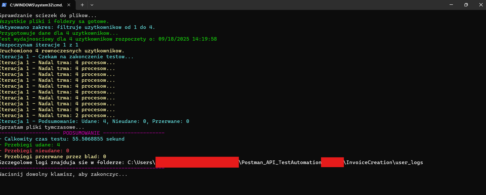
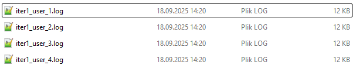
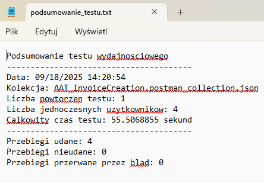

# API Integration and Performance Testing Framework for SalesAPP

This repository showcases a comprehensive framework for API integration and performance testing, built using Postman, Newman, and PowerShell. The project is designed to simulate complex, end-to-end user workflows within a web-based POS application, demonstrating a robust and scalable approach to API test automation.

The framework not only validates the functionality of individual endpoints but also tests the entire business flow. A key feature is its capability for performance testing through parallel request execution, mimicking real-world concurrent user activity.

## ✨ Key Features

  * **End-to-End Workflow Simulation**: Each collection represents a full business process (e.g., Day Opening, Invoice Creation), not just isolated API calls.
  * **Data-Driven Testing**: Tests are powered by external JSON data files, allowing for easy scalability from one to an infinite number of users without touching the test logic.
  * **Custom PowerShell Test Runner**: A powerful and user-friendly engine (`.ps1`) to orchestrate test execution, manage test data, and provide real-time feedback.
  * **Parallel Execution for Performance Testing**: Some collections are specifically designed to run requests concurrently, simulating multiple users interacting with the system at the same time.
  * **Automated Logging and Reporting**: The framework automatically generates:
      * Detailed logs for each user in every iteration (`user_logs/`).
      * A concise summary file (`podsumowanie_testu.txt`) after each run.
      * A rich, graphical interface directly in the PowerShell terminal during execution.
  * **Dynamic Configuration**: Easily configure the number of iterations and the range of users to test directly from the runner script.
  *  **Additional -** Folder "LoggingWithGoogleCloudMailSender" contains integration with Google Cloud to automatically send mail using OAuth 2.0 with tests result

## 📁 Project Structure

The repository is organized into modules, where each folder represents a distinct, automated test area. The file structure is standardized and crucial for the runner's operation.

```
Postman_API_TestAutomation_webPOS/
│
├── AutomatedDayOpening/
│   ├── AAT_Session_StartOfDay.postman_collection.json  # Postman Collection
│   ├── Session_StartOfDay.postman_environment.json   # Postman Environment
│   ├── TD_AAT_POS_DATA.json                          # Test Data (Users, POS stations)
│   ├── Run_test_automated.ps1                        # PowerShell Test Runner Engine
│   ├── podsumowanie_testu.txt                        # Generated Test Summary
│   └── user_logs/                                    # Auto-generated folder for detailed logs
│
├── InvoiceCreation/
│   └── ... (follows the same structure)
│
├── SalesOrder_ASI_parallel/
│   └── ... (performance test with parallel execution)
│
└── ... (other test folders)
```

**Note:** File names are standardized and should not be changed for the automation engine to work correctly.

## 🚀 How to Run

### Prerequisites

  * [Node.js](https://nodejs.org/) (which includes npm)
  * **Newman**: Install it globally via npm:
    ```bash
    npm install -g newman
    ```
  * **PowerShell**: Available by default on Windows.

### Step-by-Step Execution

1.  **Clone the repository** to your local machine.

2.  **Navigate to a specific test folder**, for example, `AutomatedDayOpening`.

3.  **Configure the path**: Open the `Run_test_automated.ps1` script in a text editor. You **must** update the `$basePath` variable to point to the directory where you cloned the project.

    ```powershell
    # !!! IMPORTANT: CHANGE THIS PATH !!!
    # Set this path to the root directory of the specific test folder.
    $basePath = "C:\Your\Path\To\Postman_API_TestAutomation_webPOS\AutomatedDayOpening"
    ```

4.  **Run the tests**: Open a PowerShell terminal, navigate to the test directory, and execute the script:

    ```bash
    .\Run_test_automated.ps1
    ```
    or manually run test by RMB on .ps1 file and click run by PowerShell

5.  **Observe**: The PowerShell window will display a real-time, graphical progress of the test run. Once finished, you can find the results in `podsumowanie_testu.txt` and `user_logs/`.

## ⚙️ Configuration & Customization

The framework is highly configurable, allowing for flexible test scenarios.

### Adjusting Test Execution (`Run_test_automated.ps1`)

You can modify the following variables within the runner script to control the test scope:

  * `$ITERATIONS`: Sets the number of times the entire collection will run.
      * `$ITERATIONS = 1`
  * `$startUser`: Defines the starting index from the test data file. (Default: 1)
      * `$startUser = 1` (Starts from the 1st user in the data file)
  * `$endUser`: Defines the ending index. If set to `0`, it will run for all users in the data file.
      * `$endUser = 5` (Runs for users from `$startUser` to 5)
      * `$endUser = 0` (Runs for all users from `$startUser` to the end of the file)

### Modifying Test Data (`TD_AAT_POS_DATA.json`)

The test data file is an array of JSON objects, where each object represents a user or POS station.
  * **Pre-configured Data**: The fields `POS_CODE`, `POS_ID`, and `guid` have been pre-configured for 50 POS stations. You can expand this by adding more objects to the array e.g. you can run test for 1000 users.
  * **Custom Variables**: You can add any other custom variables needed for your tests (e.g., `username`, `password`, 'product_code', 'quantity' etc.). These variables will be treated as environment variables and will take precedence during execution.
      * **Caution**: When adding new variables, it's recommended to do so incrementally and debug to ensure they are correctly integrated into the request logic.
   
**Test look like this runned by PowerShell:**


**In folder logs are created:**



**Summary is created in .txt file:**


